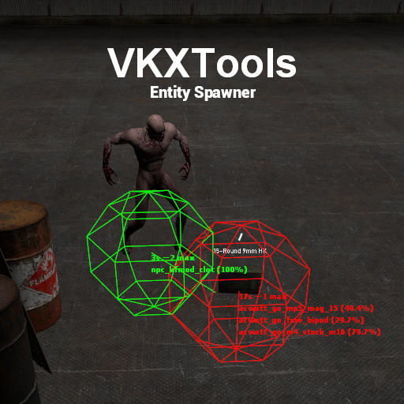

## VKXTools ─ Entity Spawner
---

This addon is available on the Workshop [here](https://steamcommunity.com/sharedfiles/filedetails/?id=2547807575)

## 📃 Description
This is a tool made for **Garry's Mod** in order to *spawn random choosen entities* in a *specific shape* with or without a *spawner*.

It allows you to spawn a lot of entities, see the following list of *compatibles categories* :
+ Weapons
+ Scripted Entities
+ NPCs
+ Vehicles
+ simfphys vehicles

### ⚪ Shapes
**Shapes** are used to spawn entities in a certain *geometrical form*, they only impact on *position*, *angle* and *number* of entities.

|  Shapes  |  Description  |
|----------|---------------|
|   `None`   | Spawn at a single point |
|  `Circle`  | Spawn in a standar circular shape with editable radius and entities number |
|  `Square`  | Spawn in a rectangular shape with editable wide, tall and offset between each entities |
|  `Random`  | Spawn in a circular shape with a random radius on each entity giving a random impression; the number, maximum radius, x and y ratios are editable as well; this shape might be usefull in *apocalypse/zombie-like servers* |

### 🤖 Spawners
**Spawners** are used to spawn *random choosen* entities at a fixed *delay* and a fixed *maximum of entities*. They can be *permanently saved* on the map or just *temporary*. They are usefull to spawn groups of NPCs (like zombies) or to spawn *vehicles* or *weapons* periodically for an apocalypse server for example.

Green spawners are non-permanent spawners and red spawners are permanent (saved and loaded on server restart) ones.

### ConVars
+ `vkx_entspawner_network_superadmin_only <0 or 1>`: **server**; default to `1`; Should the spawners be networked to superadmin only or be available for other players?
+ `vkx_entspawner_network_run <0 or 1>`: **server**; default to `0`; Should the spawners run-time be networked to allowed users? This option syncs the new spawner properties to clients. Users are defined by `vkx_entspawner_network_superadmin_only` convar

### ❗ Known Issues

#### "I can't spawn ZBASE NPCs"
You need to check the "Default Spawn Menu" option in ZBASE menu (from the 'Options' tab of the spawnmenu) in order for them to be spawnable.

### 💡 Contributions
If you are a developper and you want to help, I'm opened to contributions as long as you respect my **code style**. 

You can also suggest features and report bugs in the [issues](https://github.com/Guthen/VKXToolsEntitySpawner/issues) page.